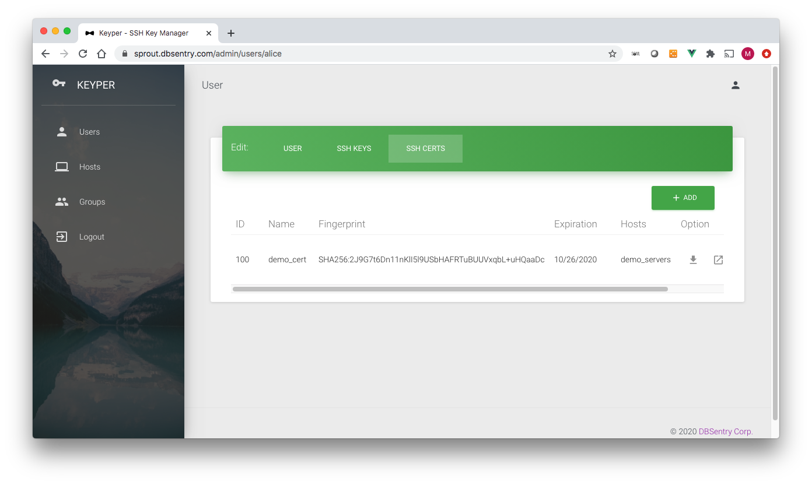
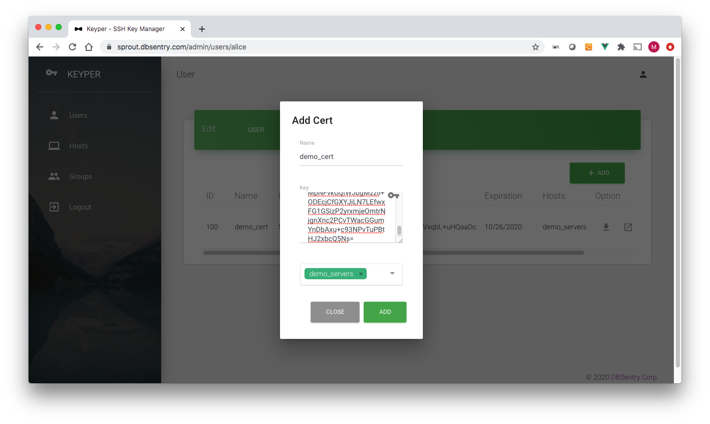
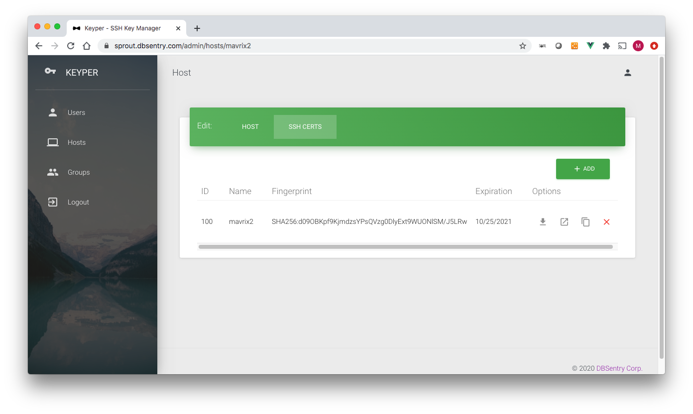

# Web Console
To access keyper web console, point your browser to the hostname you specified during startup. By default, the container listens on both port 80 (HTTP) and port 443 (HTTPS). If you are using a self-generated certificate, you'll get a warning from the browser. We recommend the use of a CA issued certificate in the production environment.

## Login


The default administrator user is **admin**. If you specified a password using environment variable **LDAP_ADMIN_PASSWORD** use that password. If you did not specify a password using environment variable **LDAP_ADMIN_PASSWORD** use **superdupersecret** as password.

```important:: Passwords are set during the first start within the OpenLDAP database. If using data persistence, which you should, the same password should be used during the subsequent startup of the container.
```  

## Users
This is where you add/delete/modify users and their SSH Public Keys. Keyper users have either of two roles:
* KEYPER_ADMIN or 
* KEYPER_USER
A user gets the KEYPER_ADMIN role if s/he is part of the *KeyperAdmins* group. Only users part of KEYPER_ADMIN groups can add/delete/modify users/groups/hosts.
A user with the role of KEYPER_USER can only modify his/her profile and add/delete SSH public keys.

By default, the keyper comes with only one user: *admin*. This user cannot be deleted.


### Add User

The Add User page has the following data fields (* denotes required field): 
* **username***: Username. Must be the same as the username on a linux system.
* **email***: Email Address
* **First Name**: First Name
* **Last Name***: Last Name
* **Display Name**: Autofilled. Concatenated first and last name
* **Principal**: User names on SSH servers Keyper user is allowed to access (e.g. root, apache). The principals are added to the certificate.
* **Groups***: Host groups the user is part of
* **Cert/Key Validity Duration***: Validity of Key/Certificate for this user in Hours/Days/Weeks

```important:: User name on the Linux system this user is allowed access to must be added to the Principal list.
```  

### Edit User

Following data fields can be edited on the Edit User page:
* **email***: Email Address
* **First Name**: First Name
* **Last Name***: Last Name
* **Display Name**: Autofilled. Concatenated first and last name
* **Principal**: User names on SSH servers Keyper user is allowed to access (for e.g. root, apache). The principals are added to the certificate.
* **Groups***: Host groups the user is part of
* **Password**: Change user's password
* **Confirm Password**: Must be same as Password
* **Cert/Key Validity Duration***: Validity of Key/Certificate for this user in Hours/Days/Weeks

### User SSH Public Keys

A key can be deleted by clicking on the delete button (```X```) against each key. 

```important:: Once a key is deleted, it gets added to Key Revocation List (KRL) and subsequently cannot be reused.
```  


The Add SSH Key page has the following data fields (* denotes required field): 
* **Name***: Name of the key. It can be anything for you to remember key by
* **Key***: Copy-Paste SSH Key
* **Groups***: Hostgroups for which this Key would work

```important:: Keyper would not allow you to add a key that was revoked earlier. Once a key is deleted, it gets added to Key Revocation List (KRL) and subsequently cannot be reused. 
```  

### User SSH Public Certificate

Following options are available for each certificate:
* Download Certificate
* Show Certificate
* Copy Certificate in the clipboard (for easy copy-paste operation)
* Delete Certificate

```important:: You can also download the certificate using CLI for any user by calling URL (e.g. curl "https://sprout.dbsentry.com/api/usercert?username=alice&keyid=103")
```  

```important:: Once a Certificate is deleted, it gets added to Key Revocation List (KRL) and subsequently cannot be reused for authentication.
```  


The Add SSH Key page has the following data fields (* denotes required field): 
* **Name***: Name of the key. It can be anything for you to remember key by
* **Key***: Copy-Paste SSH Key
* **Groups***: Hostgroups for which this Key would work

```important:: A certificate is signed using CA's user key on the fly using the validity period assigned to the user.
```  

### Edit User Profile

Following data fields can be edited on the Edit User Profile page:
* **email***: Email Address
* **First Name**: First Name
* **Last Name***: Last Name
* **Display Name**: Autofilled. Concatenated first and last name
* **Password**: Change user's password
* **Confirm Password**: Must be same as Password

## Hosts


### Add Host

The Add Host page has the following data fields (* denotes required field): 
* **Name***: Hostname. Must be the same as the hostname of the Linux system.
* **Description***: Description
* **Principal**: Names this host is known by (e.g. mavrix2, mavrix2.dbsentry.com). The principals are added to the certificate.
* **Certificate Validity Duration***: Validity of Key/Certificate for this host in Hours/Days/Weeks

When a host is added, a corresponding group with the same name is added under Groups. Besides, when a host is created it automatically gets added to *AllHosts* group

```important:: Principal must contain the hostname of the Linux systems. i.e. what is returned by *hostname -s*
```  

### Host Edit - Add Certificate

The Add Key page has the following data fields (* denotes required field): 
* **Name***: Name of the key. It can be anything for you to remember key by
* **Key***: Copy-paste SSH Key

```important:: A certificate is signed using CA's host key on the fly using the principal and validity period assigned to the host.
```  


Following options are available for each certificate:
* Download Certificate
* Show Certificate
* Copy Certificate in the clipboard (for easy copy-paste operation)
* Delete Key

```important:: You can also download the certificate using CLI for any user by calling URL (e.g. curl "https://sprout.dbsentry.com/api/hostcert?hostname=getafix2&keyid=100")
```  

```important:: Once a Certificate is deleted, it gets added to Key Revocation List (KRL).
```  

## Groups
By default Keyper comes with two groups:
* KeyperAdmins: Any user part of this group gets KEYPER_ADMIN role. This group cannot be deleted.
* AllHosts: This is a self-managed group, where a host is automatically added/deleted when the corresponding host is added or deleted.


### Add Group

The Add Group page has the following data fields (* denotes required field): 
* **Name***: Hostname. Must be the same as the hostname of the Linux system.
* **Description***: Description
* **Users***: Users member of this group
* **Hosts***: Hosts member of this group