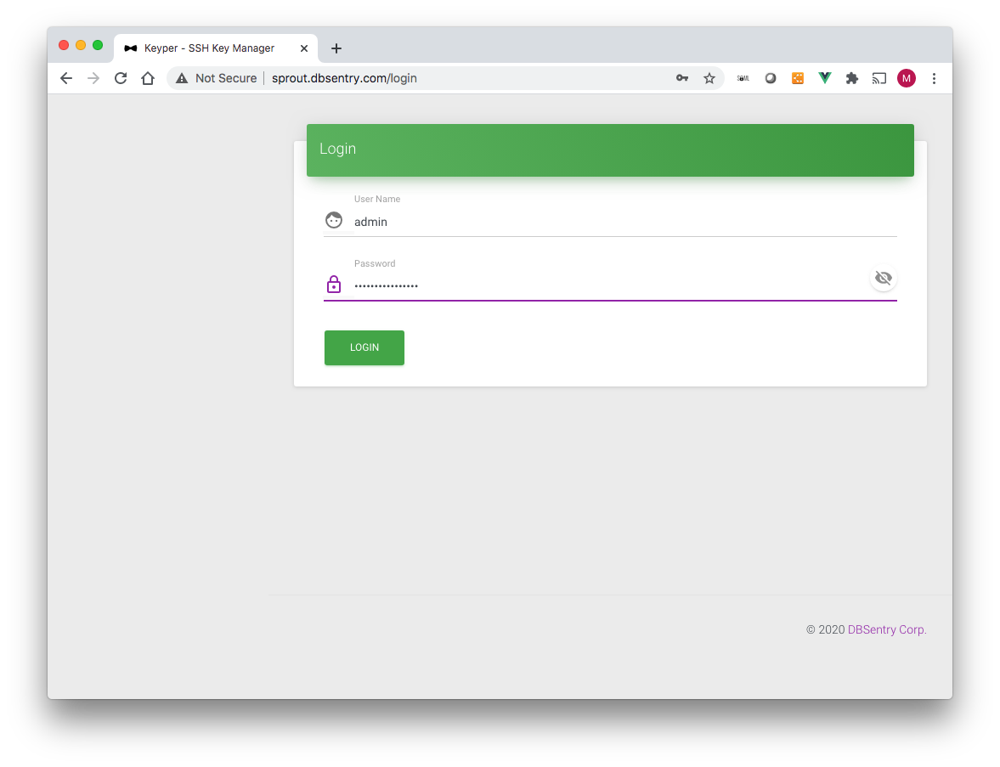
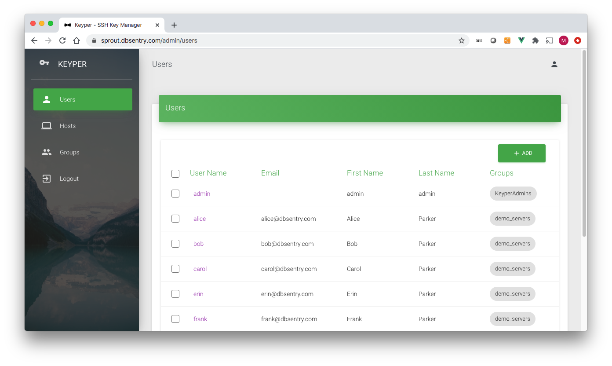
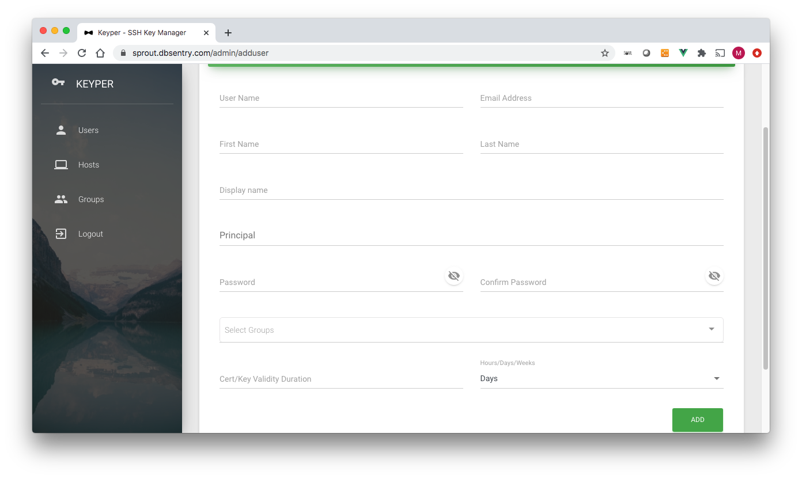
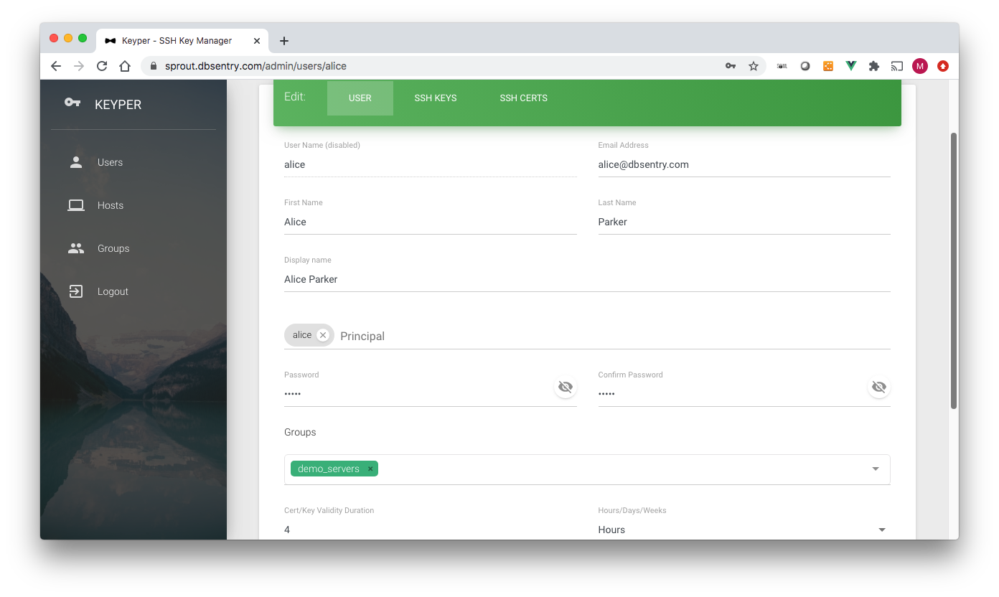
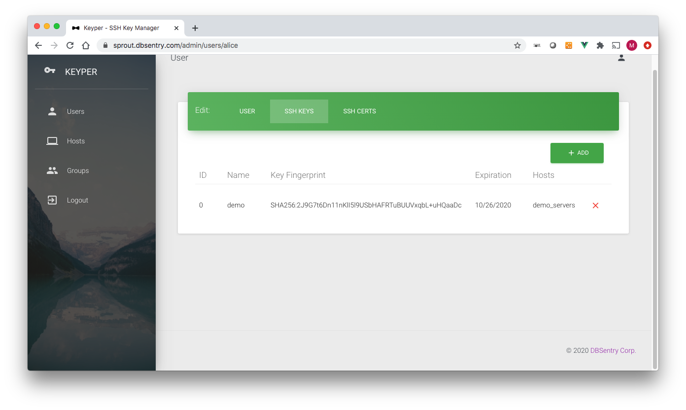
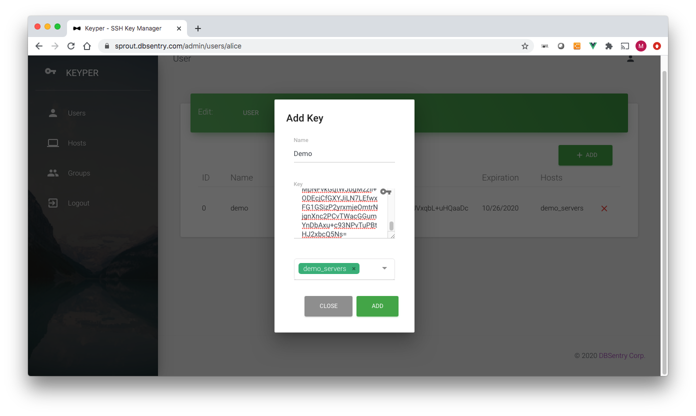
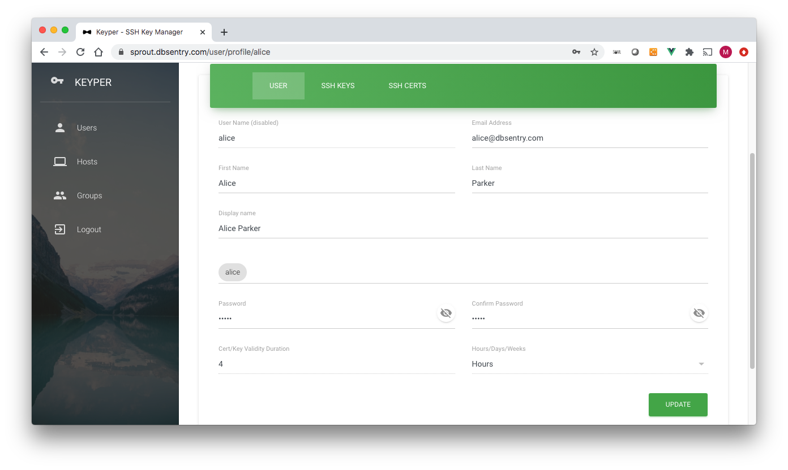
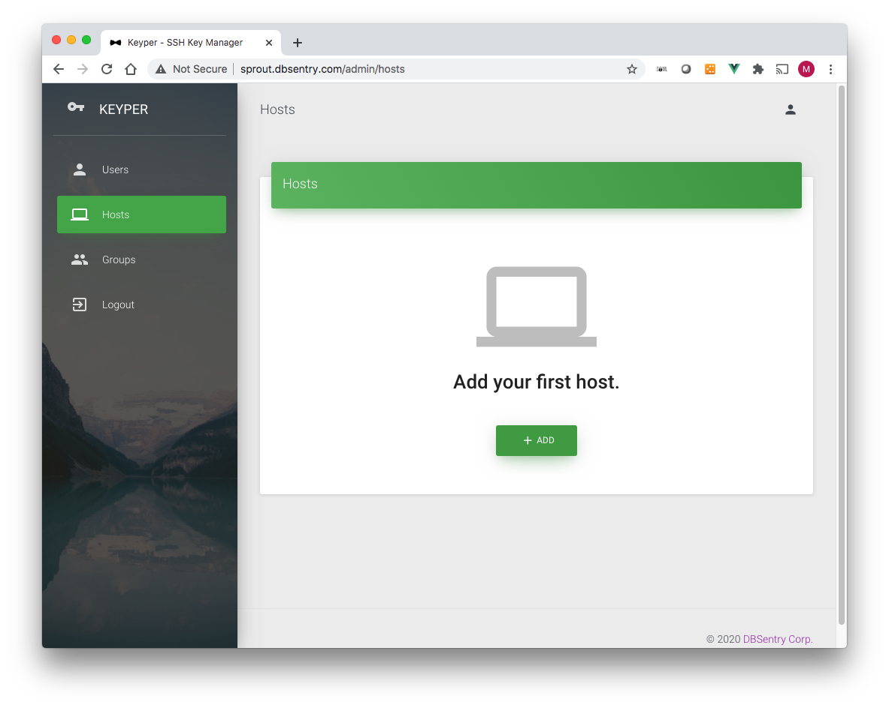
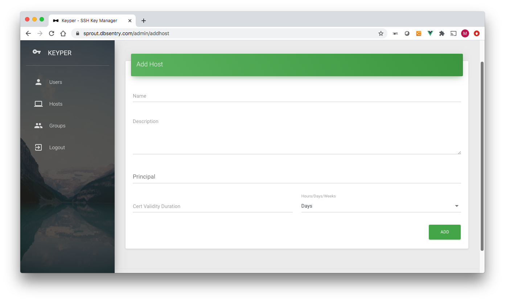
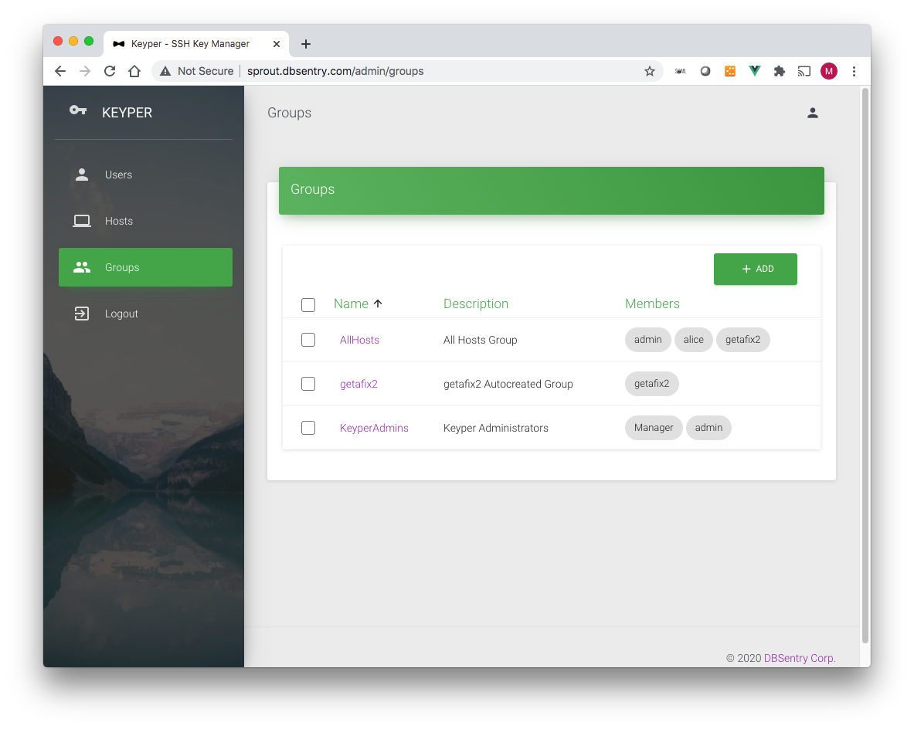

# Web Console
To access keyper web console, point your browser to the hostname you specified during startup. By default, the container listens on both port 80 (http) and port 443 (https). If you are using a default self-generated certificate, you'll get a warning from the browser. We recommend the use of a CA issued certificate in the production environment.

## Login


Default administrator user is **admin**. If you specified a password using environment variable **LDAP_ADMIN_PASSWORD** use that password. If you did not specify a password using environment varible **LDAP_ADMIN_PASSWORD** use **superdupersecret** as password.

```important:: Passwords are set during the first start within openldap database. If using data persistence, which you should, the same password should be used during subsequent startup of the container.
```  

## Users
This is where you add/delete/modify users and their SSH Public Keys. Keyper users have either of two role:
* KEYPER_ADMIN or 
* KEYPER_USER
A user gets the KEYPER_ADMIN role if s/he is part of the *KeyperAdmins* group. Only users part of KEYPER_ADMIN groups can add/delete/modify users/groups/hosts.
A user with the role of KEYPER_USER can only modify his/her profile and add/delete SSH public keys.

By default, keyper comes with only one user: *admin*. This user cannot be deleted.



### Add User

The Add User page has following data fields (* denotes required field): 
* **username***: Username. Must be same as the username on linux system.
* **email***: Email Address
* **First Name**: First Name
* **Last Name***: Last Name
* **Display Name**: Autofilled. Concatenated first and last name
* **Groups***: Host groups user is part of

```important:: Username must be same as the username on linux systems.
```  

### Edit User

Following data fields can be edited on Edit User page:
* **email***: Email Address
* **First Name**: First Name
* **Last Name***: Last Name
* **Display Name**: Autofilled. Concatenated first and last name
* **Groups***: Host groups user is part of
* **Password**: Change user's password
* **Confirm Password**: Must be same as Password

### User SSH Public Keys



The Add SSH Key page has following data fields (* denotes required field): 
* **Name***: Name of the key. It can be anything for you to remember key by
* **Key***: Copy paste SSH Key
* **Validity***: Validity in number of days for the key is going to be active
* **Groups***: Hostgroups for which this Key would work

### Edit User Profile

Following data fields can be edited on Edit User Profile page:
* **email***: Email Address
* **First Name**: First Name
* **Last Name***: Last Name
* **Display Name**: Autofilled. Concatenated first and last name
* **Password**: Change user's password
* **Confirm Password**: Must be same as Password

## Hosts


### Add Host

The Add Host page has following data fields (* denotes required field): 
* **Name***: Hostname. Must be same as the hostname of the linux system.
* **Description***: Description

When a host is added, a corresponding group with the same name is added under Groups. In addition, when a host is created it automatically gets added to *AllHosts* group

```important:: Hostname must be same as the hostname of the linux systems. i.e. what is returned by *hostname -s*
```  

## Groups
By default keypers comes with two groups:
* KeyperAdmins: Any user part of this group gets KEYPER_ADMIN role. This group cannot be deleted.
* AllHosts: This is a self managed group, where a host is automatically added/deleted when corresponding host is added or deleted.


### Add Group

The Add Group page has following data fields (* denotes required field): 
* **Name***: Hostname. Must be same as the hostname of the linux system.
* **Description***: Description
* **Users***: Users member of this group
* **Hosts***: Hosts member of this group